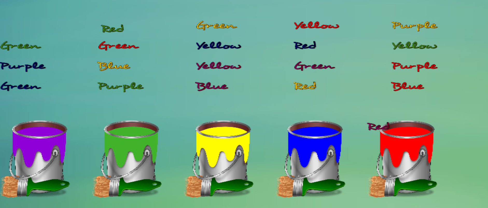

<p align="center">
  <a href="https://www.psychotechnology.com/experiments/stroop-test/" target="_blank">
    
  </a>
</p>
<h1 align="center">Stroop Test</h1>
<p align="center">Gamified version of the famous Stroop Test experiment. Made with Phaser 3.</p>
<h2 align="center">Demo</h2>
<p align="center">Check out the live demo at <a href="https://www.psychotechnology.com/experiments/stroop-test/" target="_blank">psychotechnology.com/experiments/stroop-test</a>.</p>
<h2 align="center">Installation</h2>
To install the dependencies for the Stroop Test game, run the following command in your terminal:

```bash
npm install
```

<h2 align="center">Scripts</h2>
<p align="center">In the project directory, you can run:</p>

```bash
npm start
```

<p align="center">Starts the development server for the game.</p>
<h2 align="center">The Game</h2>
<p align="center"><strong>Part One</strong> - Drag words to matching color.<br />
<strong>Part Two</strong> - Drag words to matching meaning.</p>
<h2 align="center">Preview</h2>
<p align="center"></p> 
<h2 align="center">Contributing</h2>
<p align="center">Contributions to the project are always welcome! Please open an issue or a pull request if you'd like to contribute.</p>
<h2 align="center">License</h2>
<p align="center">This project is licensed under the MIT License. See the <a href="LICENSE">LICENSE</a> file for more information.</p>
